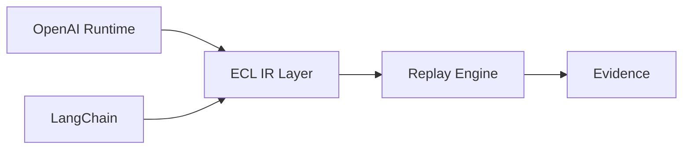

# ECL External Architecture

Single diagram:


```mermaid
flowchart LR
  O["OpenAI Runtime"] --> E["ECL IR Layer"]
  L["LangChain"] --> E
  E --> R["Replay Engine"]
  R --> V["Evidence"]
```

Text form:

```text
OpenAI Runtime ->\
                  -> ECL IR Layer -> Replay Engine -> Evidence
LangChain       ->/
```

