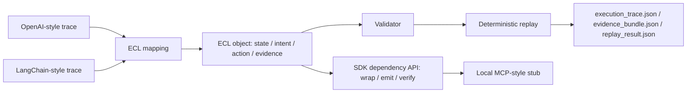

# ECL: A Deterministic Cross-Runtime Execution IR with Replayable Semantics and Dependency Interface

Status: draft_not_submitted

Version: v0.1-paper-draft

Date: 2026-06-28

## Abstract

Agent runtimes increasingly expose traces, tool calls, callbacks, and event streams, but these records are usually tied to a specific framework. This paper presents Execution Compact Layer (ECL), a deterministic execution intermediate representation for agent systems. ECL maps runtime traces into four replayable surfaces: `state`, `intent`, `action`, and `evidence`. The v0.1 system includes a frozen JSON schema, OpenAI Agents SDK and LangChain trace adapters, deterministic validation and replay, an embeddable SDK, a dependency-mode API, and a local MCP-style anchor stub. Local evaluation shows stable replay hashes, cross-runtime fixture conversion, schema validation, and no drift across the locked v0.1 surfaces. ECL is not a framework, public standard, benchmark, or external adoption claim. It is a local, reproducible system artifact for representing agent execution semantics across runtime boundaries.

## 1. Introduction

Modern agent systems produce execution traces through framework-specific surfaces: model inputs, tool calls, callback events, run trees, spans, and evidence logs. These records are useful inside their host frameworks, but they are difficult to compare, replay, or cite across runtimes without rewriting the host runtime or assuming a common execution model.

ECL addresses this gap by defining a minimal deterministic representation for agent execution. The goal is not to replace agent frameworks. The goal is to provide a compact execution IR that can be generated from heterogeneous traces and replayed into stable local artifacts.

This paper makes four contributions:

1. A four-surface execution model: `state`, `intent`, `action`, and `evidence`.
2. A deterministic hash and replay contract for local execution records.
3. A cross-runtime mapping surface for OpenAI Agents SDK-style and LangChain-style traces.
4. A dependency interface and local MCP-style stub that expose ECL without modifying host runtimes.

## 2. Problem Statement

Agent execution records are fragmented across runtimes. A tool call in one framework may appear as a span, callback, run node, trace event, or tool invocation object in another. Existing traces can preserve rich local detail, but they do not necessarily provide a minimal cross-runtime representation with deterministic replay semantics.

The problem is:

```text
Given a runtime trace T from framework R,
produce a deterministic execution representation E
such that E can be validated, replayed, hashed, and cited
without modifying R or asserting full-fidelity trace preservation.
```

The required properties are:

- Minimality: ECL keeps only the execution surfaces needed for state, intent, action, and evidence.
- Determinism: repeated conversion and replay over the same inputs produces identical hashes.
- Replayability: a valid ECL object can generate execution trace, replay result, and evidence bundle artifacts.
- Loss awareness: adapter mappings can record incomplete preservation instead of silently claiming full fidelity.
- Boundary preservation: ECL references host runtime data but does not redefine the host runtime.

## 3. Related Work

### 3.1 Runtime Tracing

OpenAI Agents SDK exposes tracing for agent workflows, and LangChain exposes tracing and callback-style observability for chains, tools, and model calls. These systems are runtime-specific trace surfaces. ECL differs by mapping traces into a minimal replayable IR rather than serving as the primary runtime trace system.

### 3.2 Tool and Protocol Surfaces

The Model Context Protocol (MCP) defines a protocol surface for tools and context exchange. ECL's local MCP-style stub is not a published MCP server and not a registry integration. It is a local anchor surface that demonstrates how an execution representation can be exposed through tool-shaped functions.

### 3.3 Observability and Trace Standards

OpenTelemetry defines trace data models for distributed systems. ECL is related in spirit because it treats execution as reviewable trace data, but ECL is narrower: it targets deterministic agent execution representation, replay artifacts, and evidence bundles.

### 3.4 Intermediate Representations

Compiler and runtime ecosystems use intermediate representations such as LLVM IR and WebAssembly to separate source-level systems from execution targets. ECL uses the same separation principle at a smaller scale: host runtimes emit or are mapped into a compact execution representation.

### 3.5 Canonicalization

ECL's deterministic hash model depends on canonical JSON behavior: sorted keys, no insignificant whitespace, and SHA-256 hashing. This design aligns with the general role of JSON canonicalization schemes in making structured data hashable and reproducible.

## 4. ECL Model

An ECL record is a tuple:

```text
E = (S, I, A, V)
```

where:

- `S` is state: lifecycle, actor, persona, runtime, and correlation references.
- `I` is intent: operation, constraints, expected result, and evidence requirements.
- `A` is action: tool or operation step, execution mode, side-effect class, and parameters hash.
- `V` is evidence: result summary, trace references, event chain, policy decisions, and hashes.

The machine-readable binding is:

```text
schemas/ecl-execution-compact-layer.schema.json
```

The local semantic source is:

```text
SPEC.md
```

## 5. Formal Execution Contract

Let:

- `T_r` be a source trace from runtime `r`.
- `M_r` be a deterministic adapter for runtime `r`.
- `E` be an ECL object.
- `L` be a loss report.
- `P` be the schema and hash validator.
- `R` be the replay function.
- `H` be SHA-256 over canonical JSON.

The adapter contract is:

```text
M_r(T_r) -> (E, L)
```

The validation contract is:

```text
P(E, schema) -> valid | invalid
```

The replay contract is:

```text
R(E) -> (execution_trace.json, evidence_bundle.json, replay_result.json)
```

The determinism invariant is:

```text
If T_r, M_r, schema, checkpoint_ref, and generated_at are unchanged,
then H(E) and H(R(E)) remain unchanged.
```

The boundary invariant is:

```text
ECL records execution representation semantics.
ECL does not prove that an external side effect occurred.
ECL does not make host runtime traces authoritative outside their source systems.
```

## 6. System Design

### 6.1 Schema Layer

The schema layer defines the ECL object model and validates required fields. It is implemented in:

```text
schemas/ecl-execution-compact-layer.schema.json
ecl/validator.py
```

### 6.2 Adapter Layer

The adapter layer maps runtime traces into ECL:

```text
ecl/adapters/openai_agents.py
ecl/adapters/langchain.py
external/adoption/ecl_mapper.py
external/adoption/trace_loader.py
```

The mapping rule is:

| Runtime source | ECL surface |
| --- | --- |
| model input | state |
| reasoning or requested operation | intent |
| tool call or run step | action |
| trace events and result refs | evidence |

### 6.3 Replay Layer

The replay layer validates an ECL record and emits deterministic artifacts:

```text
demo/replay_demo.py
external/adoption/replay_adapter.py
```

### 6.4 SDK and Dependency Layer

The SDK exposes a minimal embedding surface:

```text
sdk/ecl.py
sdk/ecl_dependency.py
```

The dependency API is:

```python
import ecl_dependency as ecl

ecl_object = ecl.wrap(trace)
payload = ecl.emit(ecl_object)
result = ecl.verify(ecl_object)
```

### 6.5 Local MCP-style Anchor

The MCP-style stub exposes the dependency API through tool-shaped functions:

```text
mcp/ecl_tool_spec.json
mcp/ecl_server_stub.py
```

This is a local stub only. It is not a registry plugin, not a published MCP server, and not an external adoption signal.

## 7. Architecture



## 8. Evaluation

### 8.1 Method

The evaluation is local and fixture-based. It does not use external APIs and does not claim third-party validation. The test suite checks:

- ECL schema validation.
- OpenAI-style fixture mapping.
- LangChain-style fixture mapping.
- Replay determinism.
- SDK API stability.
- Dependency API stability.
- Local MCP-style anchor safety.
- Citation reproducibility demo stability.
- No drift in locked core files.

### 8.2 Current Local Results

The latest local validation run reported:

```text
python3 -m unittest discover -s tests
Ran 65 tests
OK
```

The citation reproducibility demo reported:

```text
python3 examples/citation_repro_demo.py
all_valid=true
all_deterministic=true
result_hash=sha256:358a039db2c737b8905d91e37e1ed8fc5ea4081dab8d25a0523b4958f7061651
```

The MCP-style anchor self-check reported valid deterministic execution with:

```text
verification_hash=sha256:3770d486d473720ae7d84546906e24214ee156ad458bee8fec3c59873ea153b8
```

### 8.3 Locked Core Surfaces

The current local evaluation keeps these core surfaces unchanged:

```text
schemas/ecl-execution-compact-layer.schema.json
sdk/ecl.py
sdk/ecl_dependency.py
mcp/ecl_tool_spec.json
mcp/ecl_server_stub.py
```

### 8.4 Interpretation

The results support a narrow claim: ECL v0.1 is locally reproducible over the included fixtures and deterministic entrypoints. The results do not support claims of public release, ecosystem adoption, production reliability, or benchmark superiority.

## 9. Discussion

ECL is most useful when execution records must be compared, replayed, or cited across runtime boundaries. The main design choice is to preserve a small execution surface rather than reproduce every runtime-specific field. This makes the representation compact but requires explicit loss reports when mappings are incomplete.

ECL also separates representation from execution. A host runtime executes. ECL records and replays the execution representation. This separation keeps the dependency interface non-invasive and avoids modifying host frameworks.

The local MCP-style stub is intentionally conservative. It demonstrates protocol surface readability but does not claim protocol adoption.

## 10. Limitations

- The evaluation uses local fixtures, not production traces.
- The system does not prove full-fidelity trace preservation.
- The current adapters target OpenAI-style and LangChain-style traces only.
- The MCP surface is a local stub, not a published MCP server.
- There is no external adoption signal in this version.
- There is no benchmark suite or leaderboard result.

## 11. Conclusion

ECL v0.1 demonstrates that agent execution traces can be mapped into a deterministic, replayable, hash-stable execution IR with a minimal dependency interface. The system is locally validated and citation-ready, but the paper-level claim remains deliberately narrow: ECL is a reproducible execution representation stack, not a framework, standard, public release, or external adoption result.

## References

- OpenAI Agents SDK tracing documentation: https://openai.github.io/openai-agents-python/tracing/
- LangChain tracing documentation: https://docs.langchain.com/langsmith/tracing
- Model Context Protocol specification: https://modelcontextprotocol.io/specification/
- OpenTelemetry trace specification: https://opentelemetry.io/docs/specs/otel/trace/
- RFC 8785 JSON Canonicalization Scheme: https://www.rfc-editor.org/rfc/rfc8785
- LLVM Language Reference Manual: https://llvm.org/docs/LangRef.html
- WebAssembly Core Specification: https://webassembly.github.io/spec/core/
